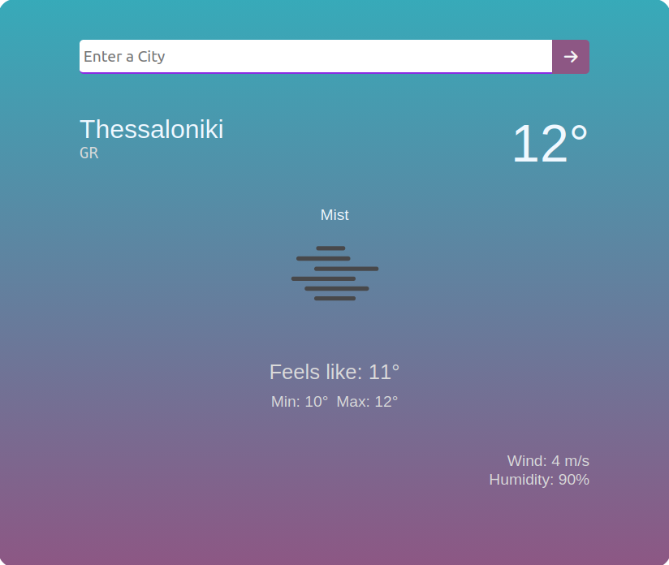

# Weather App

A simple and elegant weather application built with Node.js and Express that provides real-time weather information for any city in the world.

## Features

- 🌍 Real-time weather data for any city
- 🌡️ Current temperature and "feels like" temperature
- 💧 Humidity levels
- 🌬️ Wind speed information
- 🌤️ Weather condition description with icons
- 📊 Min/Max temperature
- 🎨 Clean and responsive user interface

## Screenshot



## Technologies Used

- **Backend**: Node.js, Express.js
- **Frontend**: EJS (Embedded JavaScript Templates), CSS
- **API**: OpenWeatherMap API
- **HTTP Client**: Axios

## Prerequisites

Before you begin, ensure you have the following installed:
- Node.js (v14 or higher)
- npm (Node Package Manager)

## Installation

1. Clone the repository:
```bash
git clone https://github.com/yourusername/weather-app.git
cd weather-app
```

2. Install dependencies:
```bash
npm install
```

## Setup

1. Get your free API key from [OpenWeatherMap](https://openweathermap.org/api)
2. Update the `API_KEY` variable in `index.js` with your own API key

## Usage

1. Start the application:
```bash
node index.js
```

2. Open your browser and navigate to:
```
http://localhost:3000
```

3. Enter a city name and click the search button to get the weather information

## Project Structure

```
weather-app/
├── index.js              # Main server file
├── package.json          # Project dependencies
├── README.md             # This file
├── public/
│   └── style.css        # Styling
└── views/
    └── index.ejs        # EJS template
```

## API Reference

The app uses the **OpenWeatherMap Current Weather Data API**:
- **Endpoint**: `https://api.openweathermap.org/data/2.5/weather`
- **Units**: Metric (Celsius)

## Error Handling

The application includes comprehensive error handling for:
- City not found (404 errors)
- API errors
- Network connection issues

## Future Enhancements

- [ ] Add weather forecast for multiple days
- [ ] Add geolocation-based weather
- [ ] Add weather alerts
- [ ] Save favorite cities
- [ ] Add more weather details (UV index, air quality)

## License

ISC License

## Contributing

Contributions are welcome! Feel free to submit a pull request.

## Author

Created as part of the Udemy Web Development Projects course.

## Support

If you encounter any issues or have questions, please feel free to open an issue in the repository.
